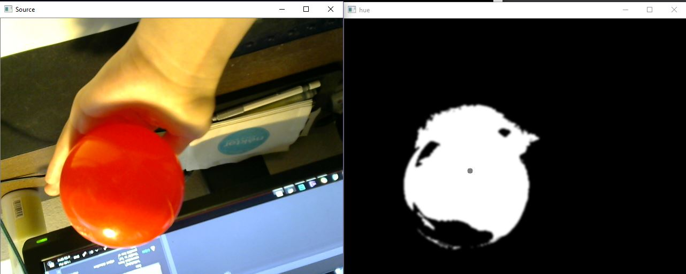
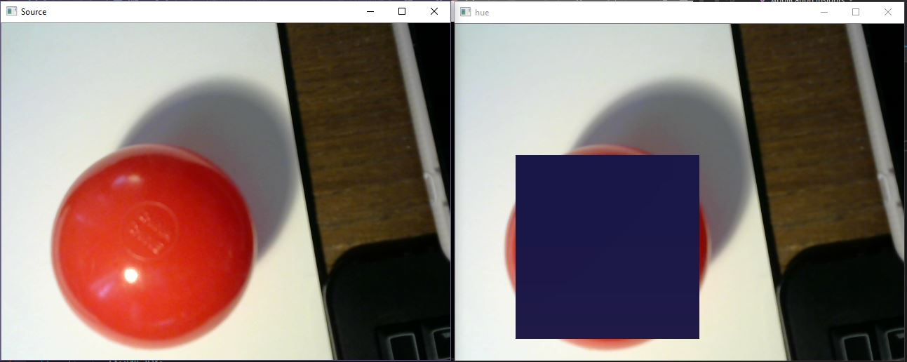

# object-detection

In this project, I use OpenCV to implement a CPU based method of finding a red object in a scene and then utilizing that centroid
position information for vedio effects.

My whole project is inspried by Chapter 26 of GPU Gem 3.
https://developer.nvidia.com/gpugems/GPUGems3/gpugems3_ch26.html

Step 1:
Implement a red color mask filter:

Step 2:
Find a centroid of the region of interest:

The result should be look like this:

Step 3:
Overlay the ROI with another image.

The final result:

